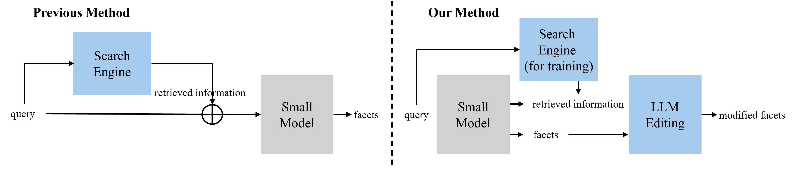

# Enhanced Facet Generation with LLM Editing, LREC-COLING 2024

The overall flow of our model.

## File Download
```
git clone https://github.com/microsoft/MIMICS
mkdir data
cd data
wget http://ciir.cs.umass.edu/downloads/mimics-serp/MIMICS-BingAPI-results.zip --no-check-certificate
```

## Data Preprocessing
### split data
Make sub files from MIMICS-BingAPI-results
```
cd data
unzip MIMICS-BingAPI-results.zip
cat MIMICS-BingAPI.result | wc -l # 479807
split -l 48000 MIMICS-BingAPI.result mimics_
```

### data/SERP_filter.py
Extract information from mimics_* and create MIMICS-BingAPI.jsonl
```
cd data
python3 SERP_filter.py
```

### data/data_preprocess.py
Create train.json and test.json in data folder
```
cd data
python3 data_preprocess.py
```

## Model Train

### query
- input: query
- output: facet
```
cd model/query
python3 facet_generation_train.py --batch 4 --epoch 10
```

### query_documet
- input: query+documet
- output: facet
```
cd model/query_document
python3 facet_generation_train.py
```

### query_related
- input: query+related
- output: facet
```
cd model/query_related
python3 facet_generation_train.py
```

### multi-task
- input: query
- output: facet / document / related
```
cd model/multi_task
python3 facet_generation_train.py --args
```

## LLM Editing
- input: generated facets
- output: re-generated facets
```
cd model/LLM
python3 facet_generation_test.py --args
```

## Compared Models
- (FG, SL, EFC) Revisiting Open Domain Query Facet Extraction and Generation
```
cd model/other_models
python3 test_compare_model.py
```
- (SR) Improving search clarification with structured information extracted from search results
```
cd model/other_models/SR_result
```

## Test
reulst: All results for the original test set.

result_filter: Results for the same test set to compare with other models.

## Evaluation
For auto evaluation
```
python3 evaluation.py --model_type {type}
```

For LLM evaluation
```
python3 evaluation_LLM.py --model_type {type}
```

## Future Work

### rationale
Generate rationale from query and facet
```
cd information/LLM
python3 generate_information7B.py
python3 construct_train_dataset.py
```

### pick information document
Use only useful information from SERPs for learning.

Information related to queries and facets in documents.
```
cd information/pick_information
python3 pick_document.py
```